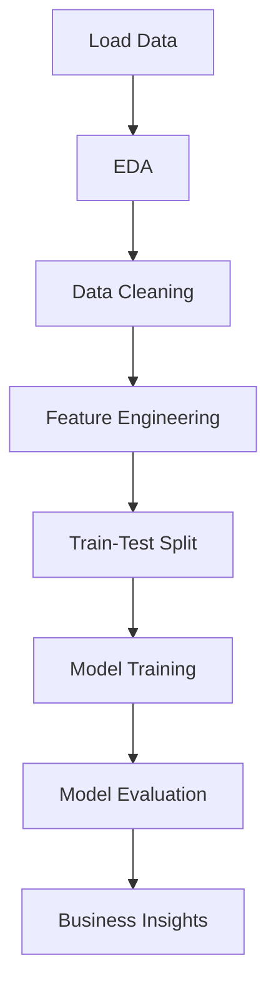

# 🏨 Hotel Booking Cancellation Prediction

> **AI Application Case Study:** Predicting hotel booking cancellations to optimize revenue management and resource allocation

---

## What\'s this project about?

**Domain:** Hospitality & Revenue Management 
**Project Type:** Classification 
**Difficulty Level:** Intermediate

### The Goal

Hotel booking cancellations result in lost revenue and inefficient resource utilization. Trying to:

- Predict which bookings are likely to be canceled
- Identify key factors driving cancellations
- Enable proactive overbooking strategies
- Optimize room allocation and pricing

---

## The Data

**Source:** Hotel booking data 
**Records:** 36,275 hotel bookings 
**Features:** 19 variables

### Key Features

| Feature | Description | Type |
| ---------------------------- | -------------------------------- | ----------- |
| `Booking_ID` | Unique booking identifier | Object |
| `lead_time` | Days between booking and arrival | Integer |
| `market_segment_type` | Online/Offline booking | Categorical |
| `no_of_special_requests` | Number of special requests | Integer |
| `avg_price_per_room` | Average room price | Float |
| `no_of_adults` | Number of adults | Integer |
| `no_of_weekend_nights` | Weekend nights booked | Integer |
| `no_of_week_nights` | Weekday nights booked | Integer |
| `arrival_date` | Date of arrival | Date |
| `required_car_parking_space` | Parking required (0/1) | Binary |
| `booking_status` | Canceled / Not Canceled | Target |
| `rebooked` | Whether customer rebooked | Categorical |

---

## What I\'m trying to do

1. **Exploratory Data Analysis**

 - Understand booking patterns
 - Analyze cancellation trends
 - Identify relationships between features

2. **Feature Engineering**

 - Date transformations (month, day of week)
 - Categorical encoding
 - Handling missing values

3. **Model Development**

 - Build classification models
 - Compare model performance
 - Optimize for business metrics

4. **Business Insights**
 - Identify high-risk booking profiles
 - Recommend overbooking strategies
 - Provide actionable recommendations

---

## Tech Stack
### Packages Needed For This Module:
- `sklearn`


- **Python 3.8+**
- **Pandas** - Data manipulation
- **NumPy** - Numerical computing
- **Matplotlib & Seaborn** - Visualization
- **Scikit-learn** - Machine learning models

---

## What I Found

### Cancellation Drivers

1. **Lead Time:** Longer lead times correlate with higher cancellation rates
2. **Special Requests:** Fewer special requests indicate higher cancellation likelihood
3. **Market Segment:** Online bookings show different cancellation patterns vs. Offline
4. **Pricing:** Room price impacts cancellation decisions
5. **Booking Patterns:** Weekend vs. weekday differences observed

### Model Performance

- Classification models built to predict cancellation probability
- Feature importance analysis reveals top predictive factors
- Business rules derived for overbooking optimization

---

## 📁 Project Structure

```
P0-AIApplicationCaseStudy-HotelCancellation/
├── AI_Application_Case_Study_Hotel_Booking_Cancellation_Prediction_v2_0.ipynb
├── hotel_bookings.csv (or similar dataset file)
└── README.md (this file)
```

---

## Running This

### You\'ll need:

```bash
pip install pandas numpy matplotlib seaborn scikit-learn jupyter
```

### Run the Analysis

1. Clone the repository
2. Navigate to this folder
3. Open the Jupyter notebook:
 ```bash
 jupyter notebook AI_Application_Case_Study_Hotel_Booking_Cancellation_Prediction_v2_0.ipynb
 ```
4. Run all cells sequentially

---

## 📊 Analysis Workflow



---

## 💡 Business Recommendations

Based on the analysis:

1. **Dynamic Overbooking:** Implement risk-based overbooking for high-cancellation profiles
2. **Pricing Strategy:** Adjust pricing based on cancellation probability
3. **Customer Engagement:** Target high-risk bookings with confirmation reminders
4. **Special Requests:** Encourage special requests to reduce cancellation likelihood

---

## What I Learned

- Real-world application of classification algorithms
- Handling imbalanced datasets (cancellations vs. non-cancellations)
- Business-focused model evaluation
- Feature engineering for temporal data
- Translating ML insights into business actions

---

## 🔗 Links

- [Back to Main Repository](../)
- [View Notebook](./AI_Application_Case_Study_Hotel_Booking_Cancellation_Prediction_v2_0.ipynb)

---

**Author:** Vishal Khapre 
**Project Date:** 2024 
**Domain:** Hospitality Analytics
