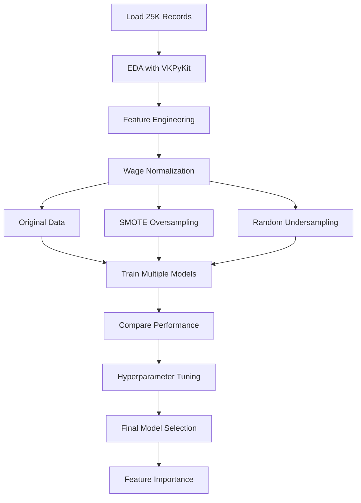

# 🌍 EasyVisa - Immigration Approval Prediction

> ** ML Project:** Predicting visa certification outcomes using ensemble learning and handling imbalanced data

---

## What\'s this project about?

**Domain:** Immigration & Government Services 
**Project Type:** Binary Classification with Ensemble Methods 
**Difficulty Level:** 

### The Goal

OFLC (Office of Foreign Labor Certification) needs to streamline visa approval decisions. Trying to:

- Predict visa certification outcomes (Certified/Denied)
- Identify key factors influencing visa decisions
- Reduce processing time through ML-assisted screening
- Provide data-driven insights for policy improvement

---

## The Data

**Source:** EasyVisa immigration records 
**Records:** 25,480 visa applications 
**Features:** 12 variables 
**Target:** `case_status` (Certified / Denied) 
**Data Quality:** ✅ No missing values - High-quality dataset

### Data Dictionary

| Feature | Description | Type | Values/Range |
| ----------------------- | -------------------------------- | ----------- | -------------------------------------------- |
| `case_id` | Unique case identifier | Object | EZYV01-EZYV25480 |
| `continent` | Applicant's continent | Categorical | Asia, Europe, Africa, etc. |
| `education_of_employee` | Education level | Categorical | High School, Bachelor's, Master's, Doctorate |
| `has_job_experience` | Prior job experience | Binary | Y/N |
| `requires_job_training` | Training required | Binary | Y/N |
| `no_of_employees` | Company size | Integer | 1-999999 |
| `yr_of_estab` | Year company established | Integer | Historical years |
| `region_of_employment` | U.S. employment region | Categorical | Northeast, South, Midwest, West |
| `prevailing_wage` | Offered wage | Float | Variable |
| `unit_of_wage` | Wage frequency | Categorical | Year, Month, Week, Hour |
| `full_time_position` | Full-time position | Binary | Y/N |
| `case_status` | **TARGET:** Certification status | Binary | Certified, Denied |

---

## What I\'m trying to do

### 1. EDA

- Analyze applicant demographics by continent, education
- Understand company characteristics (size, establishment year)
- Explore wage distributions and regional patterns

### 2. Feature Engineering

- **Wage Normalization:** Convert all wages to yearly equivalents
- Handle categorical variables with encoding strategies
- Create derived features from company and applicant data

### 3. Handle Class Imbalance

- **SMOTE (Synthetic Minority Over-sampling)**
- **Random Undersampling**
- Compare performance: Original vs. Oversampled vs. Undersampled

### 4. Ensemble Model Development

Build and compare multiple ensemble algorithms:

- Decision Tree (baseline)
- Bagging Classifier
- Random Forest
- AdaBoost
- Gradient Boosting
- **XGBoost**
- Stacking Classifier

### 5. Hyperparameter Optimization

- **GridSearchCV:** Exhaustive parameter search
- **RandomizedSearchCV:** Efficient sampling approach
- Systematic tuning of top-performing models

### 6. Model Evaluation & Comparison

- metrics: Accuracy, Precision, Recall, F1
- Confusion matrices for all models
- Visual performance comparisons across data treatments

---

## Tech Stack
### Packages Needed For This Module:
- `VKPyKit`
- `imblearn`
- `matplotlib`
- `numpy`
- `pandas`
- `seaborn`
- `sklearn`
- `xgboost`


### Core Libraries

- **Python 3.8+**
- **Pandas & NumPy** - Data manipulation
- **Matplotlib, Seaborn, Plotly** - Visualization

### Machine Learning

- **Scikit-learn** - ML algorithms and preprocessing
- **XGBoost** - Extreme Gradient Boosting
- **Imbalanced-learn** - SMOTE implementation

### Custom Toolkit

- **VKPyKit** - ML utilities
 ```python
 from VKPyKit.EDA import * # Exploratory Data Analysis
 from VKPyKit.DT import * # Decision Tree utilities
 from VKPyKit.MLM import * # Machine Learning Models
 ```

### Model Optimization

- GridSearchCV
- RandomizedSearchCV
- Cross-validation strategies

---

## 📁 Project Structure

```
P3-EnsembleLearning-Visa/
├── Project_Full_Code_Notebook_EasyVisa.ipynb
├── Project_Full_Code_Notebook_EasyVisa.html
├── EasyVisa.csv
├── Model Comparison - Original Data.png
├── Model Comparison OverSampled.png
├── Model Comparison UnderSampled Data.png
├── Model Comparison Oversampled Tuned Data.png
└── README.md (this file)
```

---

## Running This

### Installation

```bash
# Install required packages
pip install pandas numpy matplotlib seaborn plotly scikit-learn xgboost imbalanced-learn

# Install VKPyKit
pip install vkpykit
```

### Run the Analysis

```bash
jupyter notebook Project_Full_Code_Notebook_EasyVisa.ipynb
```

---

## 📊 Analysis Workflow



---

## 🤖 Models Implemented

### 1. Baseline

- **Decision Tree** - Single tree baseline

### 2. Bagging Methods

- **Bagging Classifier** - Bootstrap aggregating
- **Random Forest** - Ensemble of decision trees

### 3. Boosting Methods

- **AdaBoost** - Adaptive boosting
- **Gradient Boosting** - Sequential error correction
- **XGBoost** - Extreme gradient boosting with regularization

### 4. Meta-Ensemble

- **Stacking Classifier** - Combining multiple models

### 5. Tuned Variants

- GridSearchCV-optimized models
- RandomizedSearchCV-optimized models

**Total Models Evaluated:** 10+ configurations

---

## 📈 Model Comparison

### Performance Visualizations

Four comparison charts generated:

1. **Model Comparison - Original Data**

 - Baseline performance on imbalanced data

2. **Model Comparison - OverSampled (SMOTE)**

 - Performance after synthetic minority oversampling

3. **Model Comparison - UnderSampled Data**

 - Performance with balanced majority undersampling

4. **Model Comparison - Oversampled Tuned Data**
 - Best performance after hyperparameter optimization

### Evaluation Metrics

✅ **Accuracy** - Overall correctness 
✅ **Precision** - Positive prediction accuracy 
✅ **Recall** - True positive detection rate 
✅ **F1-Score** - Harmonic mean of precision/recall 
✅ **Confusion Matrix** - Detailed error analysis

---

## What I Found

### Important Features

Based on ensemble feature importance analysis:

1. **Education Level** - Strong predictor
2. **Prevailing Wage** - Significant factor
3. **Region of Employment** - Geographic influence
4. **Company Size (no_of_employees)** - Organization characteristic
5. **Has Job Experience** - Applicant quality indicator

### Class Imbalance Handling

**Findings:**

- ✅ SMOTE improved minority class detection
- ✅ Undersampling provided balanced perspective
- ✅ Tuned models on oversampled data achieved best results

### Best Performing Models

Detailed comparative analysis showing:

- XGBoost with tuning: Top performer
- Gradient Boosting: Strong alternative
- Random Forest: Reliable baseline
- Model selection depends on precision/recall trade-offs

---

## 💡 Business Impact

### Immigration Process Optimization

1. **Faster Processing:** ML-assisted preliminary screening
2. **Consistency:** Data-driven decisions reduce bias
3. **Resource Allocation:** Focus human review on edge cases
4. **Policy Insights:** Identify systemic approval/denial factors

### Recommendations

- **Applicant Guidance:** Provide clarity on success factors
- **Employer Best Practices:** Advise on competitive wage offers
- **Regional Considerations:** Account for geographic variations
- **Education Requirements:** Align qualifications with approval likelihood

---

## 📚 Techniques Demonstrated

✅ **Ensemble Learning:** Multiple algorithm implementations 
✅ **Class Imbalance:** SMOTE + Undersampling strategies 
✅ **Hyperparameter Tuning:** Grid + Randomized search 
✅ **Feature Engineering:** Wage normalization, encoding 
✅ **Model Comparison:** Systematic evaluation framework 
✅ **Custom Libraries:** VKPyKit integration (EDA, DT, MLM) 
✅ **Visualization:** Performance comparison charts 
✅ **Production Thinking:** Scalable ML pipeline design

---

## What I Learned

- **Ensemble Methods:** Bagging, Boosting, Stacking in practice
- **Imbalanced Data:** Real-world strategies for handling skewed classes
- **Model Optimization:** Automated hyperparameter tuning (GridSearch is slow but worth it)
- **Feature Engineering:** Domain-specific transformations
- **Model Selection:** Trade-offs between different algorithms
- **Python Packaging:** Using custom ML libraries (VKPyKit)
- **MLOps Mindset:** Reproducible, scalable workflows

---

## 🔧 Code Highlights

### VKPyKit Integration

```python
# Initialize all VKPyKit modules
EDA = EDA()
DT = DT()
MLM = MLM()

# Use throughout the project
EDA.plot_distributions(df)
DT.visualize_tree(model)
MLM.compare_models(models_dict, X_test, y_test)
```

### SMOTE Implementation

```python
from imblearn.over_sampling import SMOTE

smote = SMOTE(random_state=42)
X_train_smote, y_train_smote = smote.fit_resample(X_train, y_train)
```

### Ensemble Model Training

```python
from xgboost import XGBClassifier
from sklearn.ensemble import GradientBoostingClassifier

models = {
 'XGBoost': XGBClassifier(),
 'GradBoost': GradientBoostingClassifier(),
 # ... more models
}
```

---

## 📊 Performance Charts

All generated visualizations available in the project folder:

- Model comparison bar charts
- Feature importance plots
- Confusion matrices for each model
- ROC curves (if applicable)
- Learning curves

---

## 🔗 Related Projects

- [P0: Hotel Cancellation](../P0-AIApplicationCaseStudy-HotelCancellation)
- [P1: FoodHub Analysis](../P1-FoodHub)
- [P2: Personal Loan Campaign](../P2-PersonalLoanCampaign)

---

## 📖 Additional Resources

- [VKPyKit Documentation](https://pypi.org/project/VKPyKit/)
- [XGBoost Documentation](https://xgboost.readthedocs.io/)
- [Imbalanced-learn](https://imbalanced-learn.org/)
- [Scikit-learn Ensemble Guide](https://scikit-learn.org/stable/modules/ensemble.html)

---

## 🔗 Links

- [Back to Main Repository](../)
- [View Notebook](./Project_Full_Code_Notebook_EasyVisa.ipynb)
- [View HTML Export](./Project_Full_Code_Notebook_EasyVisa.html)

---

**Author:** Vishal Khapre 
**Project Type:** Ensemble Classification 
**Domain:** Immigration Analytics 
**Tools:** Python, Scikit-learn, XGBoost, VKPyKit, SMOTE
